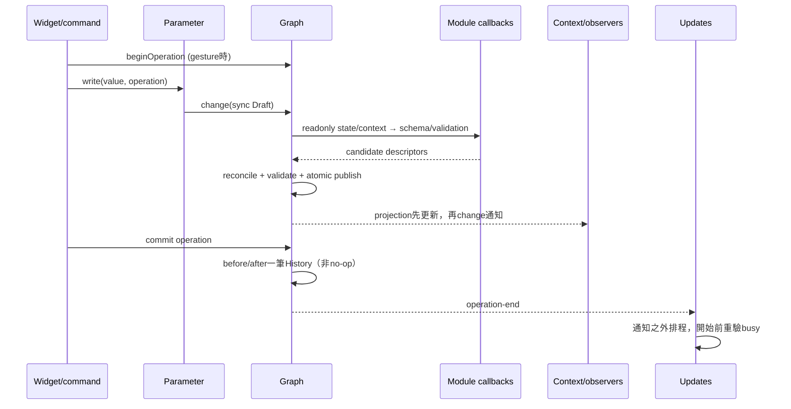
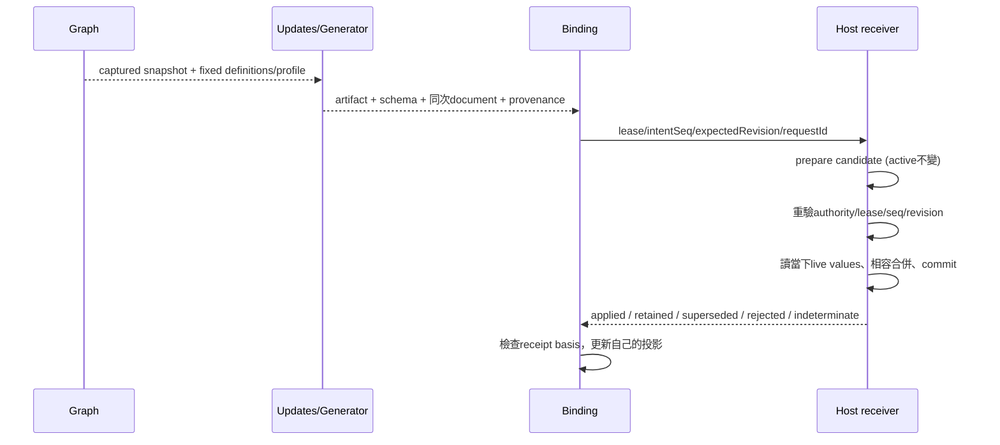

# Data and lifecycle contracts

本文件把一個使用者動作到通知／生成／保存／宿主結果的界線固定下來；細節 API 範例在 `examples/`，可執行反例在 `executable-reference/tests/`。所有必要失敗結果都必須可被呼叫者辨認，不能以 UI 尚未畫完作模型未完成的理由。

## 1. Create、edit、notification、Undo/Redo



沒有顯式 Operation 的单次 `write` 等价 begin/write/commit；通知時隱式 Operation 已關閉。顯式多批的 change 不代表整次 gesture 完成。失敗 batch 不留下半個模型，也不自動撤销前面成功批次；呼叫者仍持有 Operation，可修正、commit 或 cancel。

| 操作 | 前置／結果 | 失敗／通知／History |
|---|---|---|
| create Graph | kind、definitions、IdentitySource 有效；一次產生完整 Graph/Stage/boundary | 建立失敗沒有半張圖；無Graph內Undo、無逐Node初始化通知 |
| create Node／edit state | exact type可解析、stage允許、codec合法 | atomic Draft；callback例外／非法schema全批拒絕；成功可Undo |
| connect／replace | 同Network、端點存在、方向／型別／cycle／占用檢查 | 提交重驗；replace失敗保留舊線；一批undo |
| mode change | 新state合法，stable-key reconcile | 預設detach：失效線移入loss、Warning；`invalidEdgePolicy: 'preserve'`：保留invalid Edge並報Error，修復相容後可重新有效。model可invalid並保存；Undo恢復整組 |
| field draft | 可有parse中／IME中暫態；commit重驗target/schema及原值 | 未commit不改Graph；衝突／消失不寫鄰接欄位；保留錯誤draft供修正 |
| cancel Operation | token仍屬當前Graph | 補償回起點、發布完整change；無完成Undo entry |
| undo/redo | 無開放Operation、非通知重入 | 還原完整持久資料、revision向前；no-op不清redo；Context舊selection不強制恢復 |

模組 state/type-lock/per-shape backup 是 authored document；Widget text／selection／camera 不是。直接修改與 Parameter 修改必須走相同測試。資料集裡的數值有效不等於 GLSL 有效：shader float須有限float32、int profile範圍需驗；不能先保存 Infinity 再等生成失敗。

## 2. Save、reload、import、replacement

| 路徑 | Canonical identity／mutation | Completion 與禁止事項 |
|---|---|---|
| **exportJSON** | 讀當前完整已發布 Graph，包括gesture已發布部分 | 同步結果；不清dirty、不等生成、不包含text draft |
| **save** | 捕捉document/revision，adapter持久寫入；Graph仍可繼續編輯 | ACK只標記該內容。晚到成功不清較新dirty；write失敗不改saved baseline；不自動commit gesture |
| **download** | 輸出snapshot副本 | 檔案下載被觸發不等於持久保存成功，不能清dirty |
| **load / reopen** | 解析後一次建立新Graph lifetime；持久ID保留、loadId新建 | 先驗結構/refs/definitions，History空；舊runtime handle失效；無逐步新增事件 |
| **import review / accept** | 候選審查固定base load/document/pins；accept經一筆Graph change替換內容 | 同runtime Graph/Context保持，可Undo；候選含Error或base變動拒絕；重覆accept拒絕 |
| **Reload Applied** | 明確確認後以Host已交付快照替換目前工作session；不是一般import | draft撤銷、History reset、late callbacks需Gate驗證；Host快照不是自動canonical。 |

可表達的語意錯誤（缺模組、required input等）允许load/save並帶diagnostics。無法解析唯一身分的壞文件不能回「成功但丟了半張」；保留原始內容與failure/recovery資訊。新原型嚴格JSON上限只是驗證界線，各Legacy入口限制由對應slice落實。

## 3. Definition resolution、references、子圖

Registry 初始化後取得 immutable DefinitionSet；Graph/History/snapshot 依固定內容工作。新增 registry 版本不刷新開啟圖。缺定義保 opaque record、exact ref、最後port schema、可追蹤refs；能保存不表示能安全跨Graph重映射。一般load不能偷偷呼 initializer重造serialized state。

複製／跨圖paste先計算依賴閉包，分配新ID，只重映射宣告引用、nominal type／symbolic extent、自指boundary等；普通字串不改。整個paste原子接受或拒絕。共享子圖的semantic edit若觸發library-local fork，引用改向與caller reconcile同批；位置-only編輯不因此換identity。不要把新建禁放source的規則變成刪除既有source的load規則。

**Legacy unknown revision→current emitter 與 new exact pin 的差異尚未閉合。** 在相關Gate前，不能承諾舊圖revision相容，也不能修改Registry自動fallback來逃避。

## 4. Generate、publish、live update



有更晚意圖時，舊compile即使成功也不能發布。只在前端忽略ACK不夠。Graph Undo也是新的intent；cache命中不讓新意圖沿用舊request。code/schema/document一定同次捕捉，不得拼接。

Host live write不走Generator：capture expected field identity/shape/driver/revision → groupCAS → receipt。gesture的update可多次即時寫，seal形成一步自己的ValueHistory；cancel只能在expected仍相符時補償。外部改值衝突不可硬覆蓋。Graph/history、HostValueHistory、NativeDefinitionHistory各守領域；DEC-GRAPE-001 延後 mixed coordination，目前按明確 editing/command domain dispatch，不做全局最近操作 fallback。未commit field draft先用本地編輯語意；Panel不是History owner。

Graph Undo先完成 canonical restore，再由active Binding嘗試新的conditional live write；不新增Graph entry、不等Host成功才推Graph cursor。適用的既有intent/receipt basis若已被外部driver或TD Undo使其失效，就回conflict/divergence，不以最新mirror自動rebase，也不rollback Graph Undo。publication仍保留相容actual values，不能用resetSourceIds/default replay代替。外部高頻observation只更新runtime/readback；不進Graph/application Undo。分域收據確認、load/epoch fence、LU-UI-009與Reload Applied驗收均保留。

## 5. Attach、reconnect、destruction

| 事件 | 保留 | 失效／清理 |
|---|---|---|
| attach | Graph與document不變 | 明確Target＋capabilities＋authority建立Binding；UI origin不等於identity |
| disconnect | Graph、Binding引用、Host last-good可能繼續執行 | 標offline/stale；live訂閱與輸入gesture依receipt封存；不猜未ACK成功 |
| reconnect／Host restart | 保存文件、可顯示舊觀察但標stale | 重驗Target incarnation與authority；新lease/epoch；先readback，再決定新意圖；不盲重放side effects |
| unbind | Graph、Host已發佈成果 | 撤銷本地lease/handlers/live mirror權威；Context binding清空、pin顯missing；不刪Host用戶資源 |
| hide／move Tab | Panel/Context/Graph；移動保留Panel identity | hide可停重繪；不是dispose Graph |
| close Tab／Panel | Graph與History、其他Context | 先busy/canClose，再清訂閱、render資源、routing；借用Context不可任意destroy |
| unload Graph | 已保存文件、外部獨立產物 | 底層unload先檢查dirty／引用／Operation，未解除就回blockers，不自動刪除引用者。application的明確close流程先確認，再透過各owner釋放自己建立的Context／Binding與jobs，最後才unload；不能假裝遠端物理取消 |

Late result 必須驗適用的 loadId、Context navigation revision、Panel request token、Binding epoch、Target incarnation、artifact/request basis。不是每個事件都有全部欄位，但不得用節點同名或OP同路徑替代所需身份。

唯一安全的成功通知時間是「該owner已完整提交後」；跨owner／跨程序整體原子性沒有證據時，回報各域完成／未完成／未知，不能用一個成功布林掩蓋。

## 6. IH-002 Panel／Inspector composition

精確的輸入、輸出、ordering、failure 與範例以 [Panel contract](executable-reference/repair/PANEL_COMPOSITION_CONTRACT.md) 及 [Scoped Parameter contract](executable-reference/repair/SCOPED_PARAMETER_CONTRACT.md) 為準；它們是此次明記的修訂，不覆寫封存 reference。

```text
bootstrap → register PanelType → open SavedPanel in Pane
  → factory → resolver-based restore → visibility → initial resolved/missing target
Context/Graph publication → shared routing → fresh lease + target → Panel projection
retarget → invalidate old target/results → resolve new exact scope → fresh projection
move Tab → keep same Panel identity/viewState/Context; update placement
close → all busy/canClose guards → invalidate leases → remove route/tab → dispose
```

create/restore/update callback 失敗保留可序列化原 state 的 placeholder，並產生 UI issue；不改 Graph、不吞掉文件。未知 Panel type/version 可在註冊對應版本後由公開 retry 恢復。Layout reload 使用明示 restore mapping 重新建立 runtime authority，保存的 Context/load ID 只是 resolver 輸入，不是自動復活的 authority。恢復後 follow routing 等明確 Canvas activation，不把磁碟 activation 歷史當本次焦點。

Inspector 接收到 resolved target 後以其 effective scope Context 開 `ScopedParameterTarget.openRouted`；所有欄位 projection 與 write 都用此 handle。scope/type/link 變動令既有 draft token 失效；不相關的位置變更不令輸入失效。terminal invalidation 必須取消訂閱，不能其後又通知 updated。shared definition 的兩個 occurrence 是不同 lease，但依既有模型共享定義值；本修訂不新增 per-occurrence canonical 值。

Panel move/hide 與純 viewState 變更不進 Graph History。fixed target 的 scope 由 application service 保留，普通 Canvas 導航不改它；close/retarget 釋放這份 scope lease。Graph semantic write／Undo／Redo 仍走原本唯一 Graph writer 邊界，Model commit 成功後即使 copy-on-write 導致原 lease 失效，也不得誤報該次寫入未提交。

## IH-003 persistence identity

正式保存／載入使用 [14_DOCUMENT_FORMAT](14_DOCUMENT_FORMAT.md)，不是 reference 的 grape-core-experiment。Graph snapshot 是序列化的唯一內容來源；Host mirror、locale preference、EditorContext 和 History 不進 canonical document。下載與 ACK save 的完成語意不合併；unknown data 的 editable／read-only recovery 邊界由格式契約決定。

## IH-004 view lifecycle closure

Panel logical lifetime 與 mount lifetime 分離。move/hide/remount 不結束 Panel、Context 或 field draft；成功 close 的 preflight 後才清理 view，再 dispose contribution/Panel。mount/update/async fencing、partial-allocation cleanup、placeholder/retry 的唯一規範在 [16](16_VIEW_MOUNT_CONTRACT.md)。不要以 view retry 重建 Graph。IH-005 的 Panel command gesture 另有明確事件路由 lifetime：unmount 會請 Application 取消未完成的 pointer gesture、補償它自己的 Operation，不影響 Panel state 或 Widget draft；見 [17](17_PANEL_COMMAND_CONTRACT.md)。普通 unmount 不是通用的「取消所有編輯」入口。
