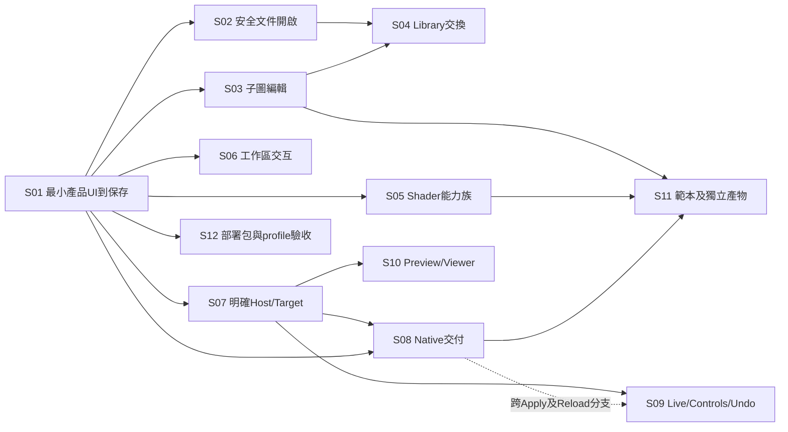

# Implementation plan：產品垂直切片

這是以 IR-001 / AC-002 / CQ-001 / MRDP-001 為輸入的交接編排，**不是新架構，也不是開始 Migration 的授權**。Handoff-ready 只表示另一個團隊可以理解責任、輸入、驗收與 gate；不等於 Migration-ready。沒有因為列出工作便宣稱它已實作。

資料真值：[slices.json](data/slices.json)；gate：[10_KNOWN_GATES.md](10_KNOWN_GATES.md)／[gates.json](data/gates.json)；完整產品行為：[11_LEGACY_COMPATIBILITY.md](11_LEGACY_COMPATIBILITY.md)。每個 Capability ID 可以跨 slice；每個 slice 的完成也不會自動更改 CQ-001 的 disposition。

**本修訂已採用的產品範圍。** [DEC-GRAPE-001](provenance/product-decisions/DEC-GRAPE-001.md) 為 accepted 外部產品決策，本包原樣攜帶其證據並把有效 scope 編譯進 slices/Gates；不用重新詢問 owner。Coordinated Mixed History、LC-UI-100 與 AT-S09-03 是 `DEFERRED_BY_PRODUCT_DECISION`，不是 Covered/PASS；S09 改為分域 Undo。這是 scope 決策，不是實作開始或 runtime 驗收。

## Current implementation 的唯一進度入口

本輪只修 Handoff，**沒有開始 S01**。[implementation-state.json](implementation-state.json) 是 IH-005 的唯讀初始範本，所有 project/baseline/build/slice/evidence 都是空值。只有未來取得正式實作授權時，才把範本複製到**本包上一層的 `implementation-state.json`**，改 `recordRole` 為 `current`；不可在 frozen package 內維護進度。這個固定外部位置是 PM／Implementer／Reviewer 的第一入口，`project.root` 再指向實際 production checkout。外部檔不存在表示 NOT_REGISTERED，不代表已開始，也不觸發建檔。Not-started 範本的 decisionReferences／gateDecisions 仍為空；已接受政策由 IH-005 baseline／provenance 承載，不能為登錄政策捏造 project/baseline。真正開工後可依既有規則引用該決策 hash；包內 state-patch 僅是原外部決策的歷史 adoption evidence。

| 欄位 | 意義／更新責任 |
|---|---|
| `schemaVersion`, `handoffRevision`, `recordRole`, `currentRecord` | schema 2、IH-005、current；locator 固定 `../implementation-state.json`，相對於此 package。採用下一份 Handoff 需明示修訂，不改封存来源。 |
| `status` | `not-started`／`active`／`paused`／`complete`；complete 只描述登錄的實作範圍，不代表全 618 功能完成或所有 Gate 通過。 |
| `project: {id,root}` | 正式產品 ID 與 checkout 位置；root 相對外部 state 檔目錄解析。它不是 reference/example 根目錄。 |
| `implementationBaseline: {id,revision,decisionReferenceIds}` | 正在實作的 baseline 名稱與精確不可變 revision（例如 commit）；不是 AC/CQ 或已驗收宣告。 |
| `build: null \| {id,revision,profile,artifact}` | 最近指定的產品 build，寫實際 revision／deployment profile／產物位置；沒有 build 留 null。build 路徑相對 state 檔目錄。 |
| `activeSlices`, `completedSlices` | active 為已知 Slice ID；completed 每筆為 `{sliceId,scope,implementationRevision,evidenceIds}`，不可與 active 重疊。完成需同 revision 的 product-behavior 與 architecture-conformance accepted evidence；僅通過 reference 不足。 |
| `gateDecisions` | 只記 scoped delta：`{gateId,scope,disposition,reason,residualScope,evidenceIds}`。disposition 是 blocked／deferred／resolved-for-scope。未記的 Gate 繼承 frozen gate 狀態；不複製成另一份 baseline truth。resolved 必須有直接指向該 Gate 的 accepted evidence，並說明剩餘範圍。 |
| `acceptedEvidence`, `latestAcceptedEvidenceId` | 保留最新與所有被 completion／Gate 引用的證據：`{id,kind,scope,file,sha256,implementationRevision,acceptedBy,acceptedAt,sliceIds,gateIds}`。kind 為 product-behavior／architecture-conformance／integration／product-decision；file 相對 state 檔目錄。latest 指最新 acceptedAt 的紀錄。 |
| `decisionReferences` | 工程決策／Architecture Change／產品決策的引用：`{id,kind,status,scope,reason,file,sha256,sliceIds,gateIds,evidenceIds,acceptedBy?,acceptedAt?}`。baseline 只能引用 accepted 項；proposed 不會變成權威。未裁定保留 proposed。檔案與 hash 可核查，工具不驗接受者真偽。 |
| `updatedAt` | 實際更新時間的 ISO8601；初始範本為 null。不使用時間來取代 revision 或驗收。 |

Implementer 在修改 production baseline／活動切片後更新外部紀錄；完成及 Gate scope 解封只記 reviewer／owner 真正接受的證據。先完整寫臨時檔並驗證，再以原子替換更新 current 檔，避免讀到半份 JSON；失敗保留先前有效紀錄。多方同時寫不是此最小 locator 的能力，指定單一維護者，其他人提交變更供其合併。它不是 application History、事件系統或產品 Graph 的一部分。

`node tools/check-implementation-state.mjs` 驗 frozen 初始範本；`node tools/check-implementation-state.mjs --current` 唯讀查外部 current，驗 Slice/Gate references、completion evidence、檔案 SHA-256 及最新證據指向。未建外部檔回 NOT_REGISTERED。工具**不能驗證人類批准真偽或證據內容是否足以解 Gate**；reviewer 必須檢查 scope 與原 Gate 的 requiredEvidence。變更任意 baseline/coverage/audit 來同步進度均屬違規。

## 工作單位與順序

每個 slice 都交付使用者能走通的操作，包含模型、必要 UI、生成／保存或 Host 回應，以及失敗路徑；不先列「做完 model，再做完 UI」的水平層任務。範圍大的 catalog 按同族 leaf 拆小批，但每批仍從實際入口一路到結果。

- **P**：規劃；已知 gate 可以帶條件納入。
- **S**：對應行為／相容契約定案，早於依賴該選擇的實作。
- **I**：第一個相關整合證據，早於擴大依賴或使用正式資料。
- **R**：對應能力／平台驗收，早於對外相容承諾。

Gate 依具體分支生效，不是整個 slice 的無條件等待。S01 的新圖流程不需要先解決 legacy revision import；S04 的 literal library 不因 Personal 符號陣列政策未定而全部被封鎖。若正式契約必須修改，依 [12_DECISION_LOG.md](12_DECISION_LOG.md) 留記錄，不能由實作者自行改測試換取通過。

共用的 **G-HANDOFF-CQ-OWNERSHIP／HC-001** 從S01開始適用：不得把`sourceSummary`中的CQ責任混寫當作架構指令。按02/03/05/06的既定契約實作不受阻；來源摘要尚未正式修訂。機器清單已把它列入受影響slice，以下個別Gate列表只列其原行為／環境門檻。

| Slice | 可觀察交付 | 先前 slice | 與後續的關係 |
|---|---|---|---|
| S01 | Host-free 最小可使用編輯流程 | 無 | 第一個可使用的產品切片；必有最小UI |
| S02 | 安全開啟、檢閱與保存既有文件 | S01 | 依該slice的scope/gates交付，不要求所有同ID分支同時完成 |
| S03 | 子圖的建立、巢狀編輯與全圖 callers 更新 | S01 | 依該slice的scope/gates交付，不要求所有同ID分支同時完成 |
| S04 | Library / Personal 子圖交換與可辨識資產 | S02, S03 | 依該slice的scope/gates交付，不要求所有同ID分支同時完成 |
| S05 | Shader 能力族與後端輸出 | S01 | 依該slice的scope/gates交付，不要求所有同ID分支同時完成 |
| S06 | 完整工作區與編輯互動 | S01 | 依該slice的scope/gates交付，不要求所有同ID分支同時完成 |
| S07 | 找到並明確連至正確 Host/Target | S01 | 依該slice的scope/gates交付，不要求所有同ID分支同時完成 |
| S08 | 安全交付 Shader、保留 last-good 並讀回 | S01, S07 | 依該slice的scope/gates交付，不要求所有同ID分支同時完成 |
| S09 | 即時參數、自訂控制與分域 Undo | S07；跨Apply分支另需S08 | 依該slice的scope/gates交付，不要求所有同ID分支同時完成 |
| S10 | 遠端 Preview 與獨立 Viewer 控制 | S07 | 依該slice的scope/gates交付，不要求所有同ID分支同時完成 |
| S11 | 範本建立與獨立 Shader 產物 | S03, S05, S08 | 依該slice的scope/gates交付，不要求所有同ID分支同時完成 |
| S12 | 三種部署的發佈與能力降級 | S01 | 依該slice的scope/gates交付，不要求所有同ID分支同時完成 |

這張圖是所需輸出的依賴，不要求上游slice的所有分支先全部完成。`prerequisiteOutputs`在資料檔列明精確範圍；例如S11只需S05中四個範本使用的能力族，不等待整份391-leaf catalog完成。S05 的 portable 部分可與 Host 工作平行；其 native runtime 驗收須與 S08 會合。S12 可早做最小產品打包，但其最終發布範圍只包括已完成驗收的對應 slice。S10 的 Apply capture-hold 分支需 S08，其只讀描述或 preview 取得不必等待全部 Apply 功能。

## S01 — Host-free 最小可使用編輯流程

**產品結果。** 使用者在最小 Canvas／Inspector／action UI 建立一張圖、建立 Float/Multiply/Compose 節點、編輯值與接線、查看 GLSL、Undo/Redo、ACK 保存並重開，以及獨立 JSON 下載／重開；另開兩個 EditorContext 時視圖獨立而模型共用。

**Capability IDs／groups。** LC-DATA-001、LC-DATA-005、LC-DATA-054、LC-DATA-059、LC-NODE-011、LC-NODE-016、LC-NODE-032、LC-NODE-361–363、LC-NODE-365、LC-NODE-367、LC-NODE-369、LC-UI-001、LC-UI-008、LC-UI-025、LC-UI-034、LC-UI-042、LC-UI-047、LC-UI-076、LC-UI-091。完整逐項ID、對應CQ group及映射範圍見 [slices.json](data/slices.json) 的 S01；這些是行為oracle，不是「全部已完成」宣告。

**架構責任。** Graph/Stage/Node/Edge/Parameter；Registry/DefinitionSet/NodeType；EditorContext/CanvasView；Generator/GLSLProfile/Diagnostics；Graph.History；DocumentInput/DocumentOutput/StorageAdapter；Canvas/Parameter projection and action UI。

**前置。** 無前置slice；以交接資料與公開契約實作。

**Gates。** G-LU-NODE-005、G-LU-UI-001、G-LU-UI-003、G-UI-CONFORMANCE。Gate依其blocks、earliestRequiredPhase與實際分支適用；列出Gate不代表整個slice或所有工作必須等待。

**所需產品決策。** 沒有此slice特有的已列產品owner決策；若要改變已記錄成功／拒絕行為，仍須另外核准。

**實作範圍。**

- 最小實際瀏覽器產品入口；Canvas 可建立、選取、移動、接線，Inspector 可改純量與 Compose mode，action UI 可 Undo/Redo、產碼、保存及重新開啟。
- 以 baseline 的有限 GLSL ES profile 產生 host-free shader 文字；保護 Stage boundary，錯誤顯示可定位。
- Graph 的固定精確 modules、動態接口、單批發布、operation 分組、缺值診斷與保存生命期，皆走共同公開邊界。
- 畫面可以簡單，但不能只交 CLI/headless demo；JSON download 與 StorageAdapter 的保存確認分別呈現。

**明確不做。**

- 不支援真 TD Apply、native uniforms、preview stream、PWA 或 Electron bridge。
- 不要求全部節點 catalog、完整 UI 外觀、所有語言或進階面板佈局。
- LC-NODE-365 在此僅取得模型驗證與 portable generation 分支；不宣稱 TD GLSL 完整輸出已交付。

**Acceptance tests。** AT-S01-01、AT-S01-02、AT-S01-03、AT-S01-04、AT-S01-05、AT-S01-06、AT-S01-07、AT-S01-08；完整 Given/When/Then 在 [09_ACCEPTANCE_AND_CONFORMANCE.md](09_ACCEPTANCE_AND_CONFORMANCE.md#s01)。本包狀態全部為 planned。

**Runtime／integration 證據。**

- 至少一個宣告版本的真瀏覽器 UI 操作紀錄、JSON roundtrip、下載/取消/拒絕結果；不得只用 DOM-less 測試完成此 slice。
- GLSL文字生成與真正GPU編譯分開記錄；本slice可只交生成查看，不把浮點文字oracle稱為GPU驗證。

**Architecture conformance。**

- UI不持有另一份Graph值；改動只有Graph公開mutation。
- Generator不讀EditorContext，application/model imports不依賴Node/Electron/TD。
- Parameter為入口；port stable key、logical identity和loadId規則不被DOM位置取代。

**完成定義。** 以上最小產品流程與負向測試具執行證據；公開API語意符合基線；基本slice驗收不等於其映射leaf的全部模式已完成，也不解除其他slice gate。

**可平行。** S02 的fixture與匯入規則整理；S05 portable NodeType 定義與其 oracle；S06 的UI內容與投影實作；共用接口需與S01保持一致。

## S02 — 安全開啟、檢閱與保存既有文件

**產品結果。** 使用者打開損壞、舊版或缺模組文件，看到明確分類與原文／修復提案；接受才原子替換，缺模組內容可保留再存。

**Capability IDs／groups。** LC-DATA-002–004、LC-DATA-006–009、LC-DATA-011–013、LC-DATA-052–053、LC-DATA-056、LC-DATA-059、LC-NODE-365–366、LC-NODE-370。完整逐項ID、對應CQ group及映射範圍見 [slices.json](data/slices.json) 的 S02；這些是行為oracle，不是「全部已完成」宣告。

**架構責任。** Document inspection/ImportReview；Graph.load/Draft.replaceDocument；DefinitionSet exact references；NodeType codecs/reference descriptors；Diagnostics/History；DocumentInput/Output。

**前置。** S01：已驗證的Graph文件/公開mutation及最小開啟UI。

**Gates。** G-LU-DATA-001、G-LU-DATA-002、G-LU-DATA-004、G-LU-NODE-006、G-LU-AUDIT-003、G-VERSION-COMPAT。Gate依其blocks、earliestRequiredPhase與實際分支適用；列出Gate不代表整個slice或所有工作必須等待。

**所需產品決策。** 沒有此slice特有的已列產品owner決策；若要改變已記錄成功／拒絕行為，仍須另外核准。

**實作範圍。**

- 建立可重現的inspect→review/cancel/accept UI與格式、容量、引用驗證。
- 把已確認Legacy revision對應寫成可審查轉換規則；未定不能silent latest或silent reject後聲稱相容。
- 缺模組 codec-owned opaque state 未知欄位與最後接口保留；未知 envelope／結構欄位依14只讀保全；PNG封裝/解封與錯誤拒絕列獨立格式案例。

**明確不做。**

- 不修Legacy來源、不直接採用其函式或資料結構。
- 不把修復提案當自動套用，也不將全部old revision默換最新版。
- 宿主已套用圖重讀和分域 Undo 留 S08/S09；coordinated Mixed History 已依 DEC-GRAPE-001 延後，不是待這兩個 slice 補作；Personal 交換留 S04。

**Acceptance tests。** AT-S02-01、AT-S02-02、AT-S02-03、AT-S02-04；完整 Given/When/Then 在 [09_ACCEPTANCE_AND_CONFORMANCE.md](09_ACCEPTANCE_AND_CONFORMANCE.md#s02)。本包狀態全部為 planned。

**Runtime／integration 證據。**

- 格式與恢復案例可用portable tests；PNG/canvas/browser檔案入口及legacy golden差異需對應環境證據。

**Architecture conformance。**

- 修復/upgrade只是detached candidate，Graph接受入口才可發布。
- exact pins保持不變；兼容轉換需明示版本/損失/授權，不進Registry隱式fallback。

**完成定義。** 每種聲稱支援格式和revision都有輸入→結果oracle；缺模組與壞檔無靜默損失；G-VERSION-COMPAT在涉及舊revision前關閉或明示不交付該分支。

**可平行。** S03 local subgraph authoring；S05 portable catalog；S06 workspace UI。

## S03 — 子圖的建立、巢狀編輯與全圖 callers 更新

**產品結果。** 使用者將計算節點封裝或新建子圖，進入巢狀network編輯，調整接口並看到所有caller同步；可Make Independent、複製貼上並Undo。

**Capability IDs／groups。** LC-DATA-027、LC-DATA-029–037、LC-DATA-043–051、LC-DATA-058、LC-DATA-062、LC-NODE-368–369、LC-NODE-374。完整逐項ID、對應CQ group及映射範圍見 [slices.json](data/slices.json) 的 S03；這些是行為oracle，不是「全部已完成」宣告。

**架構責任。** Graph-owned Network/resources；NetworkSelectionScope/EditorContext；NodeType.stateReferences；shared reconcileNetworkModel；Clipboard/ScopedParameter；History/Diagnostics。

**前置。** S01：Graph/EditorContext/History及最小Canvas可用。

**Gates。** G-LU-DATA-001、G-LU-DATA-004、G-EXTENSION-WIDGET-SCOPE。Gate依其blocks、earliestRequiredPhase與實際分支適用；列出Gate不代表整個slice或所有工作必須等待。

**所需產品決策。** 沒有此slice特有的已列產品owner決策；若要改變已記錄成功／拒絕行為，仍須另外核准。

**實作範圍。**

- 真nested canvas/breadcrumb與Graph共用定義資料；occurrence可區分且context狀態獨立。
- root/nested相同dynamic reconcile、caller更新、失效線保存、loss及diagnostics同批。
- 封裝跨界線/interface dedup、依賴closure及typed symbolic remap完整演算法；已有原型只證部分不可照抄claim。

**明確不做。**

- Personal格式符號陣列政策留S04；不因此阻擋已定local clipboard。
- 來源/必要boundary節點不因封裝捷徑繞過admission。

**Acceptance tests。** AT-S03-01、AT-S03-02、AT-S03-03、AT-S03-04；完整 Given/When/Then 在 [09_ACCEPTANCE_AND_CONFORMANCE.md](09_ACCEPTANCE_AND_CONFORMANCE.md#s03)。本包狀態全部為 planned。

**Runtime／integration 證據。**

- 模型oracle+實際nested Canvas互動；large-graph效能另記，不以小圖通過保證規模。

**Architecture conformance。**

- Nested network不是私有第二Graph/History。
- 來源/state ref列舉由模組codec提供，核心不掃描任意字串猜ID。

**完成定義。** local/shared/nested caller和clipboard完整案例可重現；Personal分支仍依S04 gate另列，不能在本slice宣稱全交換已完成。

**可平行。** S02文件恢復；S04 Personal產品決策與包格式oracle；S06其他UI功能。

## S04 — Library / Personal 子圖交換與可辨識資產

**產品結果。** 使用者把內建／Personal資產放入圖，保存自包含子圖包，以可讀檔名管理，重新匯入並保留依賴identity。

**Capability IDs／groups。** LC-DATA-028、LC-DATA-038–042、LC-DATA-047。完整逐項ID、對應CQ group及映射範圍見 [slices.json](data/slices.json) 的 S04；這些是行為oracle，不是「全部已完成」宣告。

**架構責任。** Library snapshot/package builder；NodeType.stateReferences/TypeEnvironment；Document inspection；Storage provider；Graph transaction。

**前置。** S02：檔案inspect/review/accept共同邊界；不要求全部舊revision/PNG工作完成。；S03：Network/interface/typed dependency closure；不要求全部frames/互動完成。

**Gates。** G-LU-DATA-003、G-LU-DATA-005、G-LU-DATA-007、G-PD-1。Gate依其blocks、earliestRequiredPhase與實際分支適用；列出Gate不代表整個slice或所有工作必須等待。

**所需產品決策。** G-PD-1

**實作範圍。**

- reachable dependency closure、format/checksum、檔名碰撞不覆寫、逐檔錯誤隔離。
- Personal admission和圖內editing/creation admission分離；符號extent按PD-1決策實作。

**明確不做。**

- 不默默修目前Personal失敗當既定需求；不把library檔案即時同步進已載Graph。

**Acceptance tests。** AT-S04-01、AT-S04-02、AT-S04-03；完整 Given/When/Then 在 [09_ACCEPTANCE_AND_CONFORMANCE.md](09_ACCEPTANCE_AND_CONFORMANCE.md#s04)。本包狀態全部為 planned。

**Runtime／integration 證據。**

- portable package和remap測試；browser/Node/Electron storage ownership與權限各自驗收。

**Architecture conformance。**

- 外部library資產與Graph內snapshot owner分開。
- Personal接口限制不倒灌Graph.load導致舊圖被不必要拒絕。

**完成定義。** PD-1已定或受影響符號分支明確不納入本次交付；所有納入格式/extent的成功失敗往返有證据。

**可平行。** S05 catalog；S07 Host bootstrap；S06 UI與library列表內容。

## S05 — Shader 能力族與後端輸出

**產品結果。** 使用者能在產品圖中使用被選定交付範圍的 operation、來源、array/struct、texture、dynamic節點及內建子圖，獲得符合各profile的產物或明確unsupported診斷。

**Capability IDs／groups。** LC-NODE-001–391。完整逐項ID、對應CQ group及映射範圍見 [slices.json](data/slices.json) 的 S05；這些是行為oracle，不是「全部已完成」宣告。

**架構責任。** NodeType modules；Registry/DefinitionSet；TypeEnvironment；Graph resources/reconciliation；Generator/GLSLProfile/Diagnostics provenance。

**前置。** S01：NodeType登錄、參數/接線/生成/保存最小產品路徑。

**Gates。** G-LU-DATA-005、G-LU-NODE-001、G-LU-NODE-002、G-LU-NODE-003、G-LU-NODE-004、G-LU-NODE-005、G-LU-NODE-006、G-LU-UI-006、G-LU-AUDIT-002、G-LU-AUDIT-003。Gate依其blocks、earliestRequiredPhase與實際分支適用；列出Gate不代表整個slice或所有工作必須等待。

**所需產品決策。** 沒有此slice特有的已列產品owner決策；若要改變已記錄成功／拒絕行為，仍須另外核准。

**實作範圍。**

- 按CQ機制families安排縱向批次：一族節點從新增/參數/連接/生成/錯誤/保存/Undo整條路徑交付。
- 每leaf的ports/defaults/options/stage/constant/side-effects/resource要求以Behavior Contract為oracle，不把catalog壓成單一加減乘除節點。
- Portable與native分軌；native實機驗收需要S07/S08提供Target環境，但portable實作不等它。

**明確不做。**

- 不承諾所有shader target支持同樣型別、資源或derivative；sampler1D/Buffer不是WebGL能力。
- 不以golden字串不同即認定render錯，也不重錄golden掩蓋差異。
- 不在一個巨型Core switch以nodeName寫死所有節點。

**Acceptance tests。** AT-S05-01、AT-S05-02、AT-S05-03、AT-S05-04；完整 Given/When/Then 在 [09_ACCEPTANCE_AND_CONFORMANCE.md](09_ACCEPTANCE_AND_CONFORMANCE.md#s05)。本包狀態全部為 planned。

**Runtime／integration 證據。**

- 每族portable行為測試；實際shader compiler/GPU numerical oracle和支持平台矩陣按leaf補齊。
- LU-NODE-001/006等限制仍需保留；backend第一個I先驗代表性可行，再擴至各族R。

**Architecture conformance。**

- module callbacks不mutateGraph/History/DOM。
- 模組特有State由codec/reference descriptor負責；共用TypeEnvironment是唯一型別判斷。
- 生成結果綁snapshot/load/revision，diagnostic反查不跨delivery冒用。

**完成定義。** 宣告交付族的全部leaf/mode有行為和runtime證據；未交付族顯式留待辦。只有全部391 leaf涵蓋時才可稱catalog parity。

**可平行。** S03/04子圖與交換；S06 UI；S07/08 Host整合；native驗收最後會合。

## S06 — 完整工作區與編輯互動

**產品結果。** 使用者操作多Canvas/Parameters/Help、Layout presets、搜尋、快捷鍵、值編輯、notes、frames、clipboard與視覺偏好，切圖時各panel指向正確context。

**Capability IDs／groups。** LC-DATA-014–015、LC-DATA-020、LC-DATA-022、LC-DATA-024–026、LC-DATA-054、LC-DATA-063、LC-UI-001–099。完整逐項ID、對應CQ group及映射範圍見 [slices.json](data/slices.json) 的 S06；這些是行為oracle，不是「全部已完成」宣告。

**架構責任。** EditorContext/CanvasView；Layout/Panel/Tab/UI manager；Widgets/Parameter projection；Preferences/Action guards；Document/Clipboard providers。

**前置。** S01：同一Graph和Context、actions/Parameter基本入口。

**Gates。** G-LU-NODE-005、G-LU-UI-001、G-LU-UI-002、G-LU-UI-003、G-LU-UI-004、G-LU-UI-005、G-LU-UI-006、G-LU-UI-007、G-LU-AUDIT-002、G-PD-2、G-UI-CONFORMANCE、G-EXTENSION-PANEL、G-EXTENSION-WIDGET-SCOPE。Gate依其blocks、earliestRequiredPhase與實際分支適用；列出Gate不代表整個slice或所有工作必須等待。

**所需產品決策。** G-PD-2

**實作範圍。**

- 逐實際UI action、keyboard/touch/IME入口補行為，不用漂亮mockup替代狀態/權限。
- Layout只管區域與panel大小，Tab/context和Graph生命期分離；linkGroup routing不把selection寫入Graph。
- 既有panel種類先完成；任意外部panel type擴充另外受G-EXTENSION-PANEL，不承諾原型已支持。

**明確不做。**

- 不把UI模組私有DOM/style變成Graph持久狀態；不讓Widget自改值。
- Named presets超限政策未定前不落實靜默截斷；完整Host Viewer和native controls留S09/S10。

**Acceptance tests。** AT-S06-01、AT-S06-02、AT-S06-03、AT-S06-04；完整 Given/When/Then 在 [09_ACCEPTANCE_AND_CONFORMANCE.md](09_ACCEPTANCE_AND_CONFORMANCE.md#s06)。本包狀態全部為 planned。

**Runtime／integration 證據。**

- 真browser/platform/device版本、IME、keyboard、fractionalzoom、storage及clipboard測試；UI snapshot只作視覺補充。

**Architecture conformance。**

- UI state / model state / saved layout / preferences四域分離。
- readonly/busy guards是action入口；模型仍獨立驗證，不把UI禁用當授權。

**完成定義。** 納入發布的actions/shortcuts/panels/locale/interaction有可追溯oracle；PD-2和panelextension gate按scope處理，未交付UI能力不得隱藏成Covered。

**可平行。** S02文件流程；S05 shader catalog；S07 Host bootstrap。

## S07 — 找到並明確連至正確 Host/Target

**產品結果。** 使用者由入口或分享找到候選，明確辨認Host/Target，建立有權限的連線，安全切換/重連；native窗口action按產品決策顯示及授權。

**Capability IDs／groups。** LC-HOST-001–003、LC-HOST-008–013、LC-HOST-021–022。完整逐項ID、對應CQ group及映射範圍見 [slices.json](data/slices.json) 的 S07；這些是行為oracle，不是「全部已完成」宣告。

**架構責任。** HostDirectory/bootstrap descriptors；Connection/Target identity/Binding；Capability providers/access policy；Application actions。

**前置。** S01：可獨立存在的Graph/Editor入口；Host不可用不丟模型。

**Gates。** G-LU-HOST-001、G-LU-HOST-002、G-LU-HOST-003、G-LU-HOST-004、G-LU-AUDIT-002、G-PD-3、G-PD-4A、G-PD-4B、G-DEPLOYMENT-CONFORMANCE。Gate依其blocks、earliestRequiredPhase與實際分支適用；列出Gate不代表整個slice或所有工作必須等待。

**所需產品決策。** G-PD-3、G-PD-4A、G-PD-4B

**實作範圍。**

- identity不由URL/name/origin替代；候選、權限、connection和選定Target分開。
- ShareDescriptor/QR/clipboard與window launch是可選provider；不可用可報而不猜另一個Target。
- PD-3/4a/4b各自只約束fallback和native窗口分支。

**明確不做。**

- 不預選WebSocket/WebRTC/IPC作為產品需求；transport由已定abstractserviceadapter實作承接。
- 不將static hosting當Host提供者，不新增LAN掃描能力假裝相容。

**Acceptance tests。** AT-S07-01、AT-S07-02、AT-S07-03；完整 Given/When/Then 在 [09_ACCEPTANCE_AND_CONFORMANCE.md](09_ACCEPTANCE_AND_CONFORMANCE.md#s07)。本包狀態全部為 planned。

**Runtime／integration 證據。**

- static-web/Node-hosted/Electron各自bootstrap/permission/Target驗證；LAN本機差異與真window副作用需隔離Host。

**Architecture conformance。**

- service實現不能穿透application core去讀hostglobal。
- discovery≠授權；Binding必有明確Target，身份不可被顯示名稱替換。

**完成定義。** 明確Target基本路徑與失敗/重連實證成立；未決fallback/nativewindow分支可暫不交付，但必保留對應gate和legacycapability。

**可平行。** S05 portablecatalog；S06 UI；PD-1/PD-2決策不影響本slice。

## S08 — 安全交付 Shader、保留 last-good 並讀回

**產品結果。** 使用者將當前圖產物Apply至指定Target，取得revision/編譯結果；失敗可識別且保留可證last-good；需要時檢閱upgrade並重讀已套用圖。

**Capability IDs／groups。** LC-DATA-010、LC-DATA-012、LC-DATA-060–061、LC-UI-076、LC-UI-078、LC-UI-099、LC-UI-101、LC-HOST-004、LC-HOST-014–020、LC-HOST-062。完整逐項ID、對應CQ group及映射範圍見 [slices.json](data/slices.json) 的 S08；這些是行為oracle，不是「全部已完成」宣告。

**架構責任。** Updates/Generator/artifact snapshot；Binding/publication provider/FencedArtifactReceiver；Target/lease/receipt/ReviewTickets；Document lifecycle/Diagnostics。

**前置。** S01：同snapshot的Graph與生成產物捕捉。；S07：明確Target/authority/epoch的基本成功失敗路徑；不要求share/nativewindow全部交付。

**Gates。** G-LU-DATA-003、G-LU-DATA-006、G-LU-NODE-001、G-LU-UI-007、G-LU-UI-008、G-LU-HOST-001、G-LU-HOST-005、G-LU-AUDIT-002、G-DEPLOYMENT-CONFORMANCE。Gate依其blocks、earliestRequiredPhase與實際分支適用；列出Gate不代表整個slice或所有工作必須等待。

**所需產品決策。** 沒有此slice特有的已列產品owner決策；若要改變已記錄成功／拒絕行為，仍須另外核准。

**實作範圍。**

- capture code/schema/document一致；candidate prepare/commit、epoch/sequence/revision/shape fence和late receipt。
- 先以最小可行nativeI確認TD接受、失敗與readback，再擴批次更新/來源/upgrade。
- Reload Applied的draft/History/reset原子流程必經G-LU-UI-008；宿主保存不暗中Apply未套用草稿。

**明確不做。**

- 不承諾rollback必成功；不把indeterminate改報success，也不以記錄quarantine替代last-good證據。
- 不先大批改使用者原生資產才確認commit可行性；無權限時只保留圖可用。

**Acceptance tests。** AT-S08-01、AT-S08-02、AT-S08-03、AT-S08-04 均保留；另與 S09 共用 AT-DEC-GRAPE-001-04／05／07／08／10，驗 publication 與 conditional Undo propagation 分離、舊回覆隔離及 Reload Applied；完整 Given/When/Then 在 [09_ACCEPTANCE_AND_CONFORMANCE.md](09_ACCEPTANCE_AND_CONFORMANCE.md#s08)。本包狀態全部為 planned。

**Runtime／integration 證據。**

- 首次nativepublication須真TD/build/native thread/compile/error/readback/rollback失敗紀錄。
- 批次更新、宿主save文件位置、timeout及coldrestart另列明，不用fakeprovider全部覆蓋。

**Architecture conformance。**

- GraphHistory不兼任publication queue，Updates不持第二份model真值。
- receiver必在副作用前驗權限/epoch/sequence，read-onlyinspection不能產生write grant。

**完成定義。** 第一條native交付的可行性與failurecontract具真實證據；必要契約被否證則暫停依賴分支並提交architecturechange，不能靠bypass使測試綠燈。

**可平行。** S05portable/部分native公式；S06UI；S10無副作用preview描述；有作用鏈待Target穩定。

## S09 — 即時參數、自訂控制與分域 Undo

**產品結果。** 使用者調整 Host live 值、建立/編輯 native controls 並見回讀，連續手勢使用該 domain 的 Undo。Canvas／已提交 Inspector 使用 Graph History，Host/live controls 使用自己的 History；draft/IME 保持本地編輯。無 eligible domain 或該域空 stack 不 fallback 全局最近操作。Graph Undo 先還原 canonical model，再由 active Binding 嘗試新的 conditional live write；Host conflict 顯示 divergence，不撤回 Graph Undo。

**Capability IDs／groups。** LC-DATA-014、LC-DATA-016–019、LC-DATA-021、LC-DATA-023、LC-DATA-055、LC-DATA-057、LC-DATA-063、LC-UI-100、LC-HOST-036–060、LC-HOST-063。完整逐項ID、對應CQ group及映射範圍見 [slices.json](data/slices.json) 的 S09；這些是行為oracle，不是「全部已完成」宣告。

**架構責任。** InputValues CAS/driver/resourcebindings；NativeDefinitions/definitionhistory；GraphHistory canonical transaction／Binding conditional intent／Host own-domain receipts；Shape/Target/lifetimefences；Parameterprojection。

**前置。** S07：明確Target、control schema/readback與對應權限生命期。既有Target的live／native control不要求先Apply新shader；只有跨publication／Reload的binding schema替換、conditional propagation與receipt/lifetime競態分支，才另依賴S08的安全交付成果。機器資料以`conditionalPrerequisites`表達此條件。

**Gates。** G-LU-DATA-003、G-LU-UI-009、G-LU-HOST-003、G-LU-HOST-007、G-LU-AUDIT-002。Gate依其blocks、earliestRequiredPhase與實際分支適用；列出Gate不代表整個slice或所有工作必須等待。

**所需產品決策。** 沒有此slice特有的已列產品owner決策；若要改變已記錄成功／拒絕行為，仍須另外核准。

**實作範圍。**

- 圖default與Hostcurrentvalue分離、值與control定義authority分離；scalar/vector/matrix/texture typed寫值。
- nativecontrol pages/style/Export/Bind/externalownership/shape change和原生Undo需逐型別實作。
- 執行 DEC-GRAPE-001 R01–R09：分域 dispatch；Graph Undo 先完成，active Binding 使用適用的既有 intent/receipt basis 發新 conditional write。最新 mirror 不自動續授權；外部動畫、TD Undo、driver/shape/revision 或 ABA 造成 basis 過期就拒絕，不 force-write、不靜默 rebase。
- Runtime observation 只更新 mirror/readback，不建 Graph/application Undo、不改 dirty/Redo、不 echo；domain no-op/cancel 保留自身 Redo。
- 不建立 coordinator、partial coordinator、hidden mode、experimental toggle 或 feature flag。G-MIXED-HISTORY／LC-UI-100／原 AT-S09-03 保留 oracle 並標 deferred；安全義務依 G-LU-UI-009／G-LU-UI-008 等繼續驗。

**明確不做。**

- 不讓nativeUndo倒退動畫、其他control或Graph模型。
- 不繞過protected/externalguards，不把readback當新的useredit回送。

**Acceptance tests。** AT-S09-01／02 原文保留且 required；新增 AT-DEC-GRAPE-001-01…10，全為 `REQUIRED_NOT_EXECUTED`。原 AT-S09-03 全文保留為 `DEFERRED_BY_PRODUCT_DECISION`，不算 PASS。詳見 [09](09_ACCEPTANCE_AND_CONFORMANCE.md#s09) 與 data/slices.json。收據確認、冪等重試及 late reply 的保留子句已明確交給 DSH-07／09 等新案例，不能跟 unified claim 一起丟掉。

**Runtime／integration 證據。**

- 真TD Par/style/Bind/Export/typedUndo、動畫排除、外部改動及load競態；CAS模型不是這些結果的替代。

**Architecture conformance。**

- 三種 History 保留自己的 authority；一般 command domain dispatch 不持全局 chronology，也不回捲其他 domain。
- Graph Undo 成功後的 live conflict 不 rollback model，不新增 Graph entry；runtime mirror/receipt 不進 GraphDocument 或 Graph History。
- 生命期/權限/expectedvalue檢查位於實際寫入邊界。

**完成定義。** typed 值／定義／分域 Undo 的 AT-S09-01／02 與十項 DSH acceptance 按宣告範圍驗收；G-LU-HOST-007、G-LU-UI-009 及其他原 Gates 照舊。Mixed History 是 deferred，不必為本 release 解開，但也不能以分域通過聲稱 LC-UI-100 等價覆蓋或 G-MIXED-HISTORY 已 resolved。

**可平行。** S10Viewer/preview；S11template資產；S05其他catalog。

## S10 — 遠端 Preview 與獨立 Viewer 控制

**產品結果。** 使用者顯式取得/停止preview控制，切MAT/TOPviewer、調整viewer參數、使用mouse/touch/Home並取得圖像；preview生命期不接管Graph來源。

**Capability IDs／groups。** LC-HOST-023–035。完整逐項ID、對應CQ group及映射範圍見 [slices.json](data/slices.json) 的 S10；這些是行為oracle，不是「全部已完成」宣告。

**架構責任。** PreviewSession/lease/InputSurface；Viewer description/valueprovider；Capture/stream/encoderprovider；host-affinequeue。

**前置。** S07：明確Preview Target和權限；不等待PD-4窗口分支。

**Gates。** G-LU-UI-001、G-LU-HOST-001、G-LU-HOST-006、G-LU-AUDIT-001、G-LU-AUDIT-002、G-UI-CONFORMANCE。Gate依其blocks、earliestRequiredPhase與實際分支適用；列出Gate不代表整個slice或所有工作必須等待。

**所需產品決策。** 沒有此slice特有的已列產品owner決策；若要改變已記錄成功／拒絕行為，仍須另外核准。

**實作範圍。**

- MAT/TOP routing、source switch自動Home、normalizedcoordinates、pointer/capture取消、接管、heartbeat/cleanup。
- Viewer自己controls描述含section/style/permission，Undo/persistence能力按原生結果宣告。
- P4的touchrecognizer、resize settle和Viewerdescription須首次機制實作，不能只接UI模版。

**明確不做。**

- 不更改使用者Host內Viewer參數階層；不將Viewer參數視為Graphdefaults。
- 不要求preview生命期和GraphApply相同；Apply capturehold整合需S08。

**Acceptance tests。** AT-S10-01、AT-S10-02、AT-S10-03、AT-S10-04；完整 Given/When/Then 在 [09_ACCEPTANCE_AND_CONFORMANCE.md](09_ACCEPTANCE_AND_CONFORMANCE.md#s10)。本包狀態全部為 planned。

**Runtime／integration 證據。**

- 真TD/GPU/cook/stream/PNG/LANbrowser/device和ViewerUndo/TOEreload；支持matrix分項记录。

**Architecture conformance。**

- Previewauthority、GraphBinding和viewerinputowner分離。
- UI量測提供desiredextent，provider處理encoder能力與boundedqueue。

**完成定義。** preview取得/失敗/停止及真交互可驗；每個Viewer控件的Undo/persistence有宣告且有證據，不把未知默作支持。

**可平行。** S09live/customcontrols；S05catalog；S06ui。

## S11 — 範本建立與獨立 Shader 產物

**產品結果。** 使用者建立四個可編輯材質範本，採中性貼圖fallback；保存/重載產物並移除或重加管理元件後仍於宣告TD版本render。

**Capability IDs／groups。** LC-NODE-378–391、LC-HOST-004–007。完整逐項ID、對應CQ group及映射範圍見 [slices.json](data/slices.json) 的 S11；這些是行為oracle，不是「全部已完成」宣告。

**架構責任。** Versioned Graph assets/templateinstantiation；Binding/provisioningprovider；Storage/nativearchive/bootstrap；Generator/resources。

**前置。** S03：可保存/載入的Graph內子圖快照和caller引用。；S05：四個範本實際使用的材質/texture/normal/source/helper族；不要求其餘391-leaf catalog先全部完成。；S08：安全產物provision/commit/readback及獨立保存邊界。

**Gates。** G-LU-NODE-001、G-LU-HOST-001、G-LU-AUDIT-001、G-LU-AUDIT-002。Gate依其blocks、earliestRequiredPhase與實際分支適用；列出Gate不代表整個slice或所有工作必須等待。

**所需產品決策。** 沒有此slice特有的已列產品owner決策；若要改變已記錄成功／拒絕行為，仍須另外核准。

**實作範圍。**

- 核對對應TOX/TOE現有embedded行為作資產驗收來源；新證據走新IR，不默改封存。
- 範本是可編輯Graph/resources，不是新owner；menu是可選nativecontribution。
- default貼圖與完整材質公式、alpha/tangent/nativeenvironment以對應leaf契約驗。

**明確不做。**

- 不以管理器仍在記憶體時render證明產物独立；不保證未知TD版本。
- 不把TOX解析未完成說成binary本身架構必須繼承。

**Acceptance tests。** AT-S11-01、AT-S11-02、AT-S11-03；完整 Given/When/Then 在 [09_ACCEPTANCE_AND_CONFORMANCE.md](09_ACCEPTANCE_AND_CONFORMANCE.md#s11)。本包狀態全部為 planned。

**Runtime／integration 證據。**

- 隔離TD工程、真TOE/TOX包、build/OS/GPU、冷重載/manager移除影像及identity證據。

**Architecture conformance。**

- Artifact與editor/manager生命期分離；無UI/nativeview引用洩入Graph文件。

**完成定義。** 四份範本與產物独立性有對應真實包證據；binary未知行為若影響scope，開新IR並審查受影響能力。

**可平行。** S06UI；S09controls；S12deployment打包準備。

## S12 — 三種部署的發佈與能力降級

**產品結果。** 使用者在宣告的Static Web、Node-hosted或Electron入口開啟同樣的application能力；平台缺服務時得到可理解的不可用結果，而不是壞圖或錯Host。

**Capability IDs／groups。** LC-DATA-005、LC-DATA-040–041、LC-DATA-060–061、LC-UI-024、LC-UI-069–070、LC-UI-084–085、LC-UI-098、LC-HOST-002、LC-HOST-008–010、LC-HOST-061–062。完整逐項ID、對應CQ group及映射範圍見 [slices.json](data/slices.json) 的 S12；這些是行為oracle，不是「全部已完成」宣告。

**架構責任。** Deploymentbootstrap/serviceproviders；IdentitySource/DocumentInputOutput/Storage；Hostdiscovery/access；renderer/application importboundary。

**前置。** S01：最小可使用產品流程可在選定profile執行；最終發佈僅匯入已驗收slice。

**Gates。** G-LU-HOST-008、G-LU-AUDIT-002、G-DEPLOYMENT-CONFORMANCE。Gate依其blocks、earliestRequiredPhase與實際分支適用；列出Gate不代表整個slice或所有工作必須等待。

**所需產品決策。** 沒有此slice特有的已列產品owner決策；若要改變已記錄成功／拒絕行為，仍須另外核准。

**實作範圍。**

- 每profile列實際providers、權限、locality、storage、network/Host支持；Node-server本機不是browser-user本機。
- Electron僅增加privilegedbridge/adapter/bootstrap，不改core契約；statichosting不提供native能力。
- Host可用/斷外網/停Host/清cache首次啟動區分；PWA獨立offline不是由legacy自動要求。

**明確不做。**

- 不把三profile宣稱能力相等；不以Node測試證Electron打包。
- 不因缺PWA而宣布所有migrationblocked，也不捏造首次離線可用。

**Acceptance tests。** AT-S12-01、AT-S12-02、AT-S12-03；完整 Given/When/Then 在 [09_ACCEPTANCE_AND_CONFORMANCE.md](09_ACCEPTANCE_AND_CONFORMANCE.md#s12)。本包狀態全部為 planned。

**Runtime／integration 證據。**

- 每profile真package/browser/runtime版本與permission/boot/servicefailure證據；不要求所有profile同一時間交付，但release必明列範圍。

**Architecture conformance。**

- tools/check-boundaries.mjs靜態檢查與實際bootstrap驗收互補。
- core/model與純application不得依賴Node/Electron/TD global；只有provider持平台權限。

**完成定義。** 宣告發佈profile矩陣完成；未交付profile/平台明列，不以handoff可執行當作runtime認證。

**可平行。** S02–S11各slice開發；只有該profile宣告交付範圍的驗收最後匯合。

## 每次交付的收據

實作團隊應提供：本次slice與leaf/mode範圍、實際版本與平台、測試命令/輸入/預期/實際/退出碼、未通過與未執行案例、gate狀態及可核對證據、與baseline差異的決策記錄。沒有執行的維持planned；沒有真TD/GPU/browser證據的不能寫成runtime通過。

S01完成後可評估後續獨立slice，並非自動授權所有Migration。任何scope縮減、legacy成功路徑取消、owner/依賴方向改變，都要明確記錄；不得以改映射或跳過oracle來讓驗收看似完成。

## IH-003 的 S01 工程起點澄清

正式 application／模組使用 TypeScript；工具鏈版本在正式 checkout 建立时鎖定並記入 current baseline，不能把資格測試的 Node 25 或原型類別當产品要求。S01 建新 production 根目錄，不複製 executable-reference 及 repair implementation 作地基。可移植契約、測試 oracle、不變量，再用 production API 實作并重跑。

S01 同時需要：① ACK-backed StorageAdapter 的 save → 同筆文件 reopen（Static Web 可由 browser storage adapter 提供）；② JSON export/download → file reopen。後者不清除尚未收到保存確認的 dirty。最小 reopen 入口可用 document ID／清單選擇已保存記錄，不要求 Project、全功能文件管理器或 Host。寫入格式依 [14](14_DOCUMENT_FORMAT.md)，呈現文字依 [15](15_LOCALIZATION_CONTRACT.md)。

[Production dependency policy](tools/check-production-boundaries.mjs) 必須在 S01 的真正 source roots 上配置 manifest，不可把本包的 fixture PASS 充當產品 conformance。manifest 逐公開 export 分 query/command/mutation/snapshot/contract/service/environment；普通 extension PR 用 changedFiles 與 extensionOwner 限制不得改 unrelated core，重構 core 的變更須獨立 AC scope。

## IH-004 S01 / S06 rendering prerequisite

S01 第一版真 Canvas／Inspector 必須採用 [16 的公開 view/mount 契約](16_VIEW_MOUNT_CONTRACT.md)。不得先硬接具體內建 Panel，等 S06 再發明 extension rendering seam。S06 使用相同 registry/contribution path 新增第二個 feature。headless qualification 只證明契約；S01／S06 的實際 browser render、focus、IME、accessibility 與互動測試仍待實作。
