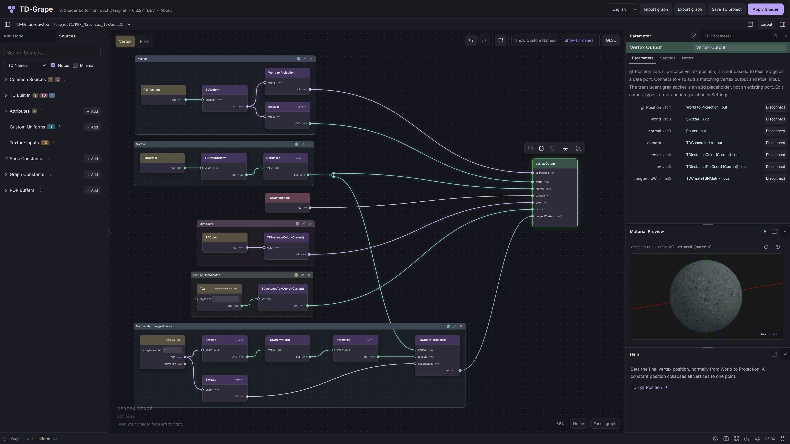
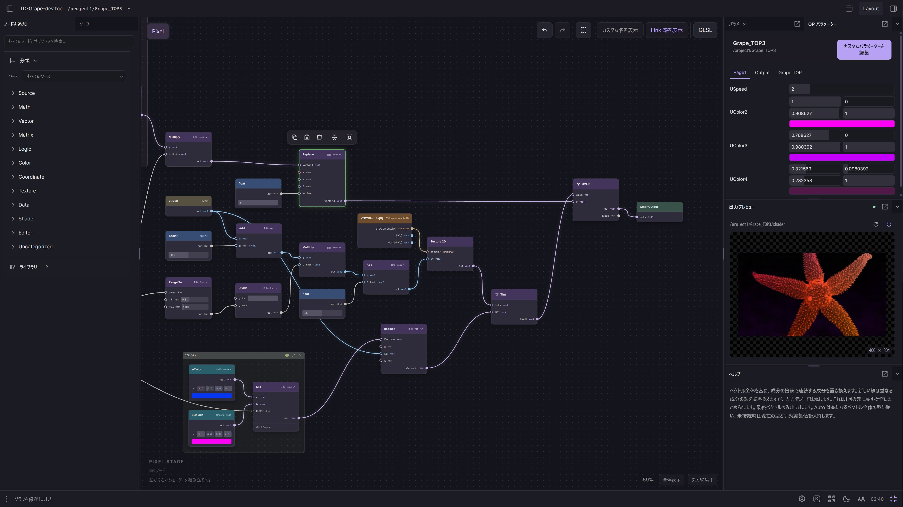
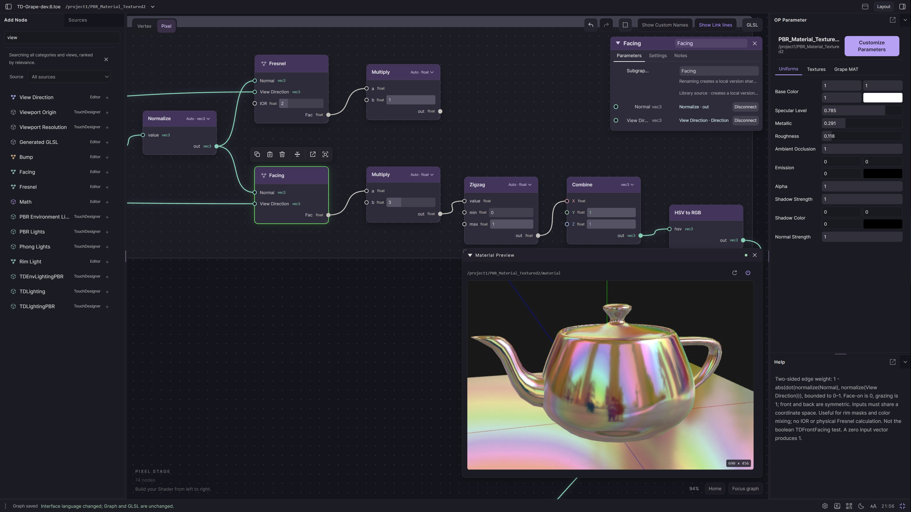
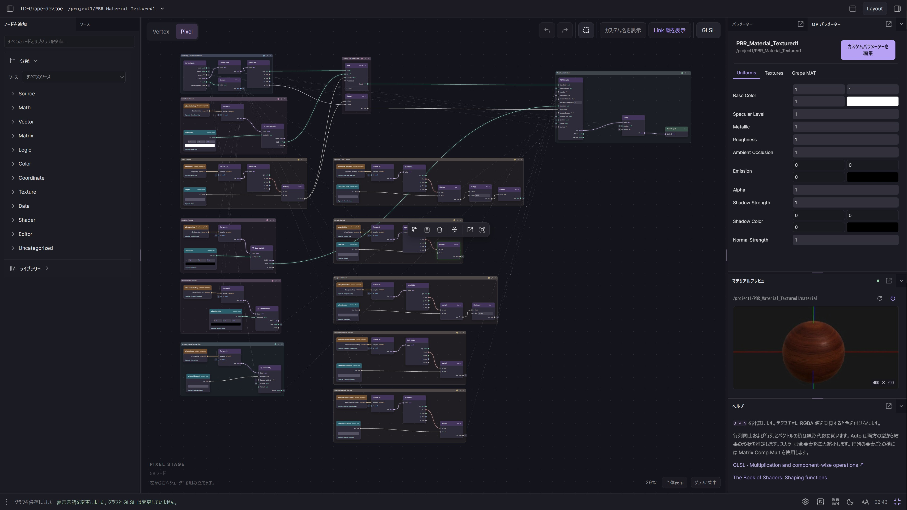
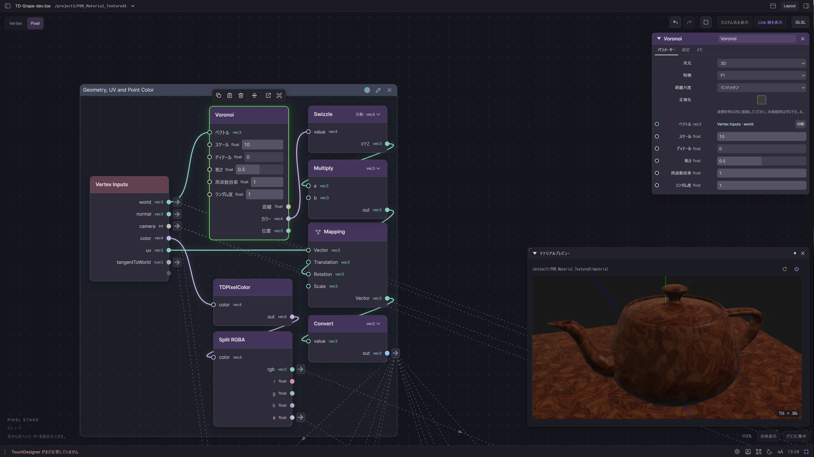

# Legacy Product screenshots

**LEGACY SCREENSHOT — visual reference only.**

這五張圖片由使用者於 **2026-10-02（Asia/Taipei）** 提供，用來理解既有 TD-Grape 的配置、節點外觀與資訊密度。原檔名、3842 × 2160 尺寸與 JPEG 內容全部保留；没有裁切、重繪或重新壓縮。檔名中的日期／時間未另行驗證，只有 LUI-01 明示產品版本，其餘版本未知。

[UI_SPEC](../UI_SPEC.md) 與原有示意圖繼續承擔設計規格／結構說明的用途；本組截圖是補充的 Legacy 參考，不是新的架構、API 或像素一致性規格。圖中的 Host 路徑、Apply Shader、Save TD project、OP Parameter 等呈現，不改變新版 canonical Graph 屬於產品的責任邊界。

圖片只證明可見的畫面狀態。沒有從中推定操作前後關係、動態接口更新、Layout 保存、Undo、即時渲染或執行環境正常，也沒有因此解除任何 Gate。來源與完整性資料見 [manifest.json](manifest.json)。

本資料夾是獨立補充：依使用者最新要求，原交接文件、[SCREEN_INDEX](../SCREEN_INDEX.md) 與 HANDOFF_FILE_INDEX 均保持原樣。它們記錄的是補充之前的交接狀態；原 SCREEN_INDEX 仍只索引 UIR 設計示意，本頁單獨索引 LUI 截圖。新增圖片由本資料夾的 manifest 管理，閱讀時不依賴原圖所在的 Pictures／Downloads 路徑。多語介面的補充討論沒有寫回原交接規格。

## LUI-01 · MAT Vertex 與停靠面板

英文介面。左側 Sources 分類，中間有命名群組、彩色曲線、被選取的 Vertex Output 及其上方工具列。右側 Parameter 顯示已連接的來源與 Disconnect，下方為球體 Material Preview 和 Help。頂部明示 **0.8.271 DEV**。

## LUI-02 · TOP Pixel 與色彩參數

日文與英文混合標籤。左側新增節點分類，中間 Replace 節點被選取，節點內可見數值與色彩欄位。右側 OP Parameter 顯示多組數值／色彩，下方 Output Preview 顯示海星及棋盤格背景，底部有 Help。

## LUI-03 · 搜尋與浮動面板

英文 MAT Pixel 工作區。左側搜尋文字為 `view`，可見結果列表與來源標籤；Facing 節點被選取。Canvas 上有浮動 Facing Parameter 與 Material Preview，右側仍有 OP Parameter 和 Help。預覽呈現彩色反射茶壺。此圖可參考浮動與停靠面板並存的外觀，不能證明其保存或焦點路由規則。

## LUI-04 · MAT Pixel 全圖視野

日文與英文混合標籤。多個命名群組排列於 Canvas，以長連線連至材質和輸出區；右側是材質 OP Parameter、球體 Material Preview 與 Help。右下顯示 **29%**，節點仍有詳細內容；不能由縮放數值推定實驗 Overview 已啟用。

## LUI-05 · 節點細節與浮動參數

Canvas 佔據大部分畫面，左右停靠側欄未顯示。Voronoi 被選取，右上浮動 Parameter 可見維度、特徵、距離等選項；右下浮動 Material Preview 顯示茶壺。圖中有 Vertex Inputs、Swizzle、Mapping、Split RGBA 等節點，並可見彩色曲線、直虛線、接孔與選取工具列。右下顯示 **112%**。

底部同時顯示 **TouchDesigner 未回應**的日文訊息。保留這個可見狀態，不推定原因、預覽是否即時或是否為快取。側欄未顯示也不代表已確認使用哪個 Layout 預設或操作命令。

## 這組圖片未涵蓋的部分

目前已足夠作為一組桌面 Legacy 外觀參考，無需為此次收錄額外補圖。若後續要審查特定互動，再補其操作前後狀態即可。這五張未呈現空圖／空選取、多選主選取、展開中的選單、接線拒絕或 missing module、參數輸入草稿／錯誤、子圖內部導覽、窄螢幕／觸控，以及同一操作的前後對照。

這些是參考資料的涵蓋限制，不是本次新增的產品需求或 Gate。
